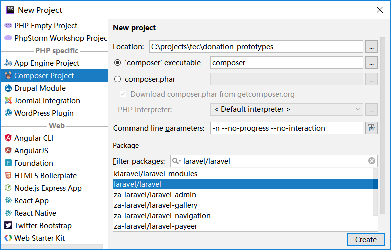

# How the project was initiated with PHP Storem

## Prerequisites

- Everything [as required by Laravel](https://laravel.com/docs/5.5/installation#server-requirements), among those,
- [PHP 7.1.3 or above](http://www.php.net/) (with certain extensions enabled)
- [Composer](https://getcomposer.org/doc/00-intro.md) 
- Alternatively, PHP 7 can be installed with [XAMPP](https://www.apachefriends.org/index.html)

## Create a new Laravel project in PHP Storm

Open PHP Storm, select "New Project" menu, and use the options as shown in the screenshot, then click on "Create" button.  Make sure command "composer" is in system path, and can be executed anywhere. 

## Set up repository 

Initiate a Git repository in the new project folder, commit all applicable files, and push to Github.