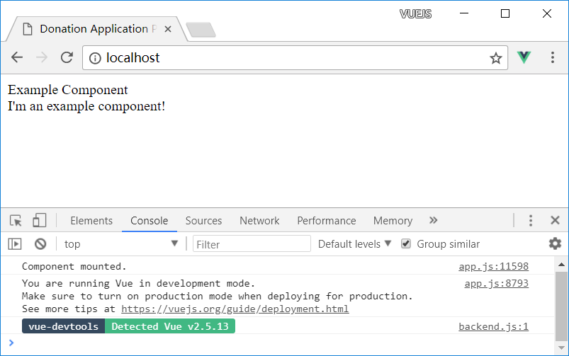

# Try to make a home page with Vue.js

## Laravel route

In `routes/web.php`, change home page route to

```
Route::get('/', function () {
    return view('index');
});
``` 

## Laravel view for home route

Create a new view `resources/views/index.blade.php`, with contents

```
<!doctype html>
<html lang="{{ app()->getLocale() }}">
    <head>
        <meta charset="utf-8">
        <meta http-equiv="X-UA-Compatible" content="IE=edge">
        <meta name="viewport" content="width=device-width, initial-scale=1">

        <title>Donation Application Prototypes</title>
    </head>
    <body>
    <div id="app">
        <app></app>
    </div>

    <script src="{{ mix('js/app.js') }}"></script>
    </body>
</html>
``` 

## app.js for Vue

Put the following contents in `resources/assets/js/app.js`

```
import Vue from 'vue';
import App from './components/ExampleComponent.vue';

const app = new Vue({
  el: '#app',
  components: { App }
});
```

## Compile Vue file(s)

Run `npm run dev` to have Vue.js file(s) compiled and saved to `public/js` folder of the project.

## Run the project with Vue

- Once JS compiling, run this project with `php artisan serv` (from project root folder) or `php -S localhost:port` (from project "public" folder)
- To have Vue.js files complied as changed, leave `npm run watch` running 

The home page should now look like this 


